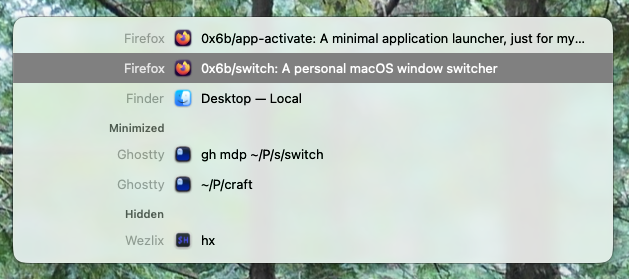

# Switch

A personal macOS window switcher. Replaces `Cmd+Tab` with a list of individual windows instead of apps.



## Usage

Hold `Cmd` and press `Tab` to open the switcher. Keep `Cmd` held while you navigate, then release it to activate the highlighted window.

Use `Opt+Tab` instead for windows of the current app only.

The list is grouped: on-screen first, then `Minimized`, then `Hidden`. Picking a minimized or hidden row un-minimizes / un-hides before raising.

## Keys

While the switcher is open with the modifier held:

| Key                                     | Action                                |
| --------------------------------------- | ------------------------------------- |
| `Tab` / `Shift+Tab`, `↓` / `↑`, `j`/`k` | Next / previous row                   |
| Two-finger swipe ↓ / ↑                  | Next / previous row (works globally)  |
| `w` / `q` / `h` / `m`                   | Close window / Quit / Hide / Minimize |
| `s`                                     | Switch to filter-typing mode          |
| `Cmd+,`                                 | Open Settings                         |
| Release modifier, or mouse click        | Activate selected, close panel        |
| `Escape`                                | Cancel                                |

In filter mode (modifier may be released), the navigation/activation keys still apply, plus:

| Key               | Action                         |
| ----------------- | ------------------------------ |
| Letters / digits  | Append to filter, list narrows |
| `Backspace`, `^H` | Delete one character           |
| `^W`              | Delete previous word           |
| `Enter`           | Activate selected              |

Matching is case- and diacritic-insensitive substring. Whitespace splits the filter into tokens that must all match.

Quit Switch from the Settings window, or `Cmd+Q` when the window is focused.

## Build

Requires macOS 26+, Xcode 26+ (macOS 26 SDK), and [`xcodegen`](https://github.com/yonaskolb/XcodeGen):

```console
$ brew install xcodegen
$ make            # list every target
$ make test       # Run the test suite
$ make build      # Build a release into ./build
$ make install    # Test, build, and copy Switch.app to ~/bin
$ make clean      # Remove ./build
```

## Accessibility

Switch installs a session-level `CGEvent` tap and reads other apps' windows via the Accessibility APIs, so macOS requires Accessibility permission. On first launch it prompts and quits. Grant access in **System Settings** → **Privacy & Security** → **Accessibility**, then relaunch.

The build is ad-hoc signed (`CODE_SIGN_IDENTITY: "-"`), so every rebuild changes the code hash. After rebuilding, remove and re-add the entry in the Accessibility list, otherwise the tap silently receives no events.

## Run at login

`Cmd+,` → check **Launch at login**. macOS may report **requires approval**. Enable the entry in **System Settings** → **General** → **Login Items & Extensions**.

## How to Contribute

This is my switcher. I'll maintain it as long as it meets my needs, or until I find a better alternative. I'm not looking for contributions, but I'm sharing the code in case it helps someone else. Please feel free to fork it and modify it however you like. I'm not interested in making this:

- more capable
- more configurable
- more user-friendly
- more attractive
- more popular
- cross-platform (beyond my future use)

There should be similar and/or more capable tools available in every language and platform, so if you have a better option, feel free to keep using that.

## Motivation

I'm a loyal user of [Contexts](https://contexts.co/), which has the window-level switching model I want, for 10 years. However its last update was [2022-08-27](https://contexts.co/whats-new/) and the future of the app is uncertain although it's totally working fine on my Mac at this time of writing. I wanted to create a plan B in case it stops working in the future. This repository is my attempt to create a similar app just solely for my own use case.

## License

MIT. See [LICENSE](LICENSE).

App icon: [`swatch-book`](https://lucide.dev/icons/swatch-book) from [Lucide](https://lucide.dev) ([ISC](https://github.com/lucide-icons/lucide/blob/main/LICENSE)).
